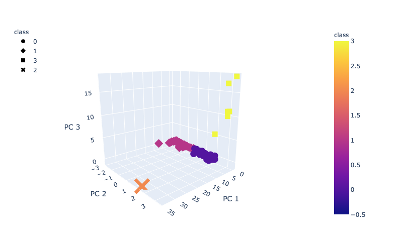
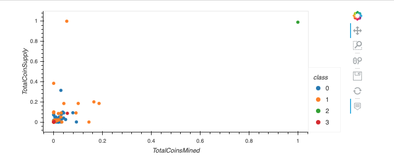

# Cryptocurrencies

## Overview of the Project 

The purpose of this project is to use unsupervised machine learning to process data, cluster, reduce dimensions and reduce the principal components using PCA to create a report that includes what cryptocurrencues are on the trading market and how they could be grouped to create a classification system for an investment.

## Results of the Project 

### 3D-Scatter with the PCA data and the clusters

### Scatter plot using x="TotalCoinsMined" and y="TotalCoinSupply"

